# Simple_Runner3D_Game

사용엔진: Unreal Engine 4.27  
제작기간: 2주 (2021.11.15 ~ 2021.11.30)  
게임플레이 영상: https://youtu.be/UtTcCEvRuSE  
게임다운: http://naver.me/FnnNiUCI

---

# 목차
+ 게임 설명
+ 게임 Stage Base
+ 게임 Stage 종류
+ 프로젝트 후
---

## 게임설명
'테일즈런너'를 모티브로 하여 캐릭터가 장애물을 피하고, 낙하해서는 안되며, 뒤에 쫒아오는 벽에 닿기전에 앞으로 이동해야하는 간단한 달리기게임  
|Start|End|
|:-:|:-:|
||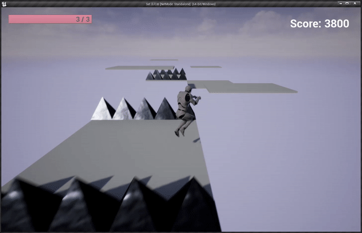|

|Wall|
|:-:|
|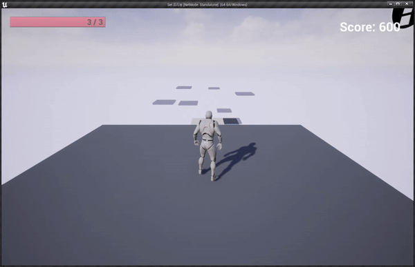|

---
## Stage Base  

|||
|:-:|:---|
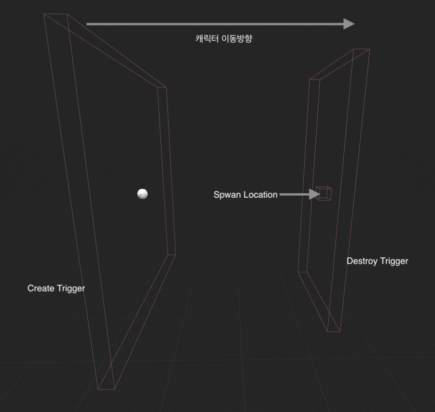| Create Trigger - 캐릭터와 충돌 시 Spwan Location위치에 다음 랜덤 스테이지가 생성된다.   Destroy Trigger - 캐릭터와 충돌 시 현재 스테이지를 삭제한다. 
---
## Stage 종류  
  
+ ### 1. Spike Obstacle  

  |||
  |:-:|:-:|
  ||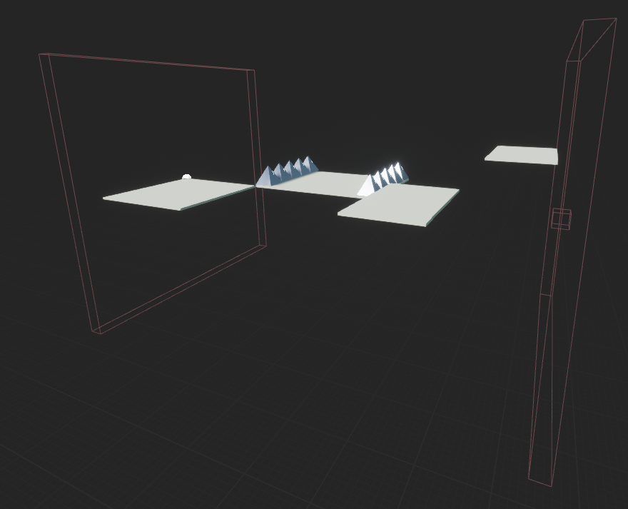|
  |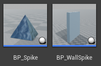|Spike에 닿았을 경우 체력이 1깍이고, WallSpike에 닿았을경우 게임 종료|

+ ### 2. xyz Move Floor Stage  

  |||
  |:-:|:---|
  ||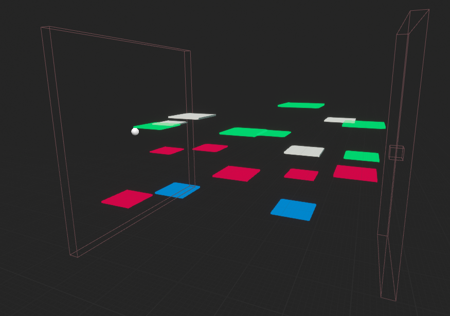|
  |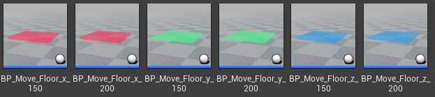 | 각각 x축, y축, z축으로 이동하고 속력이 다른 2개의 발판으로 이루어진 스테이지|

* ### 3. xy Scale Floor Stage  

  |||
  |:-:|:---|
  ||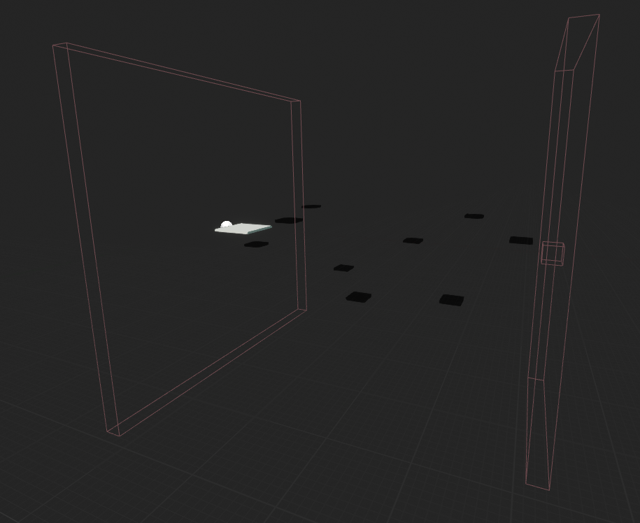|
  |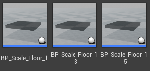 | x, y가 일정한 크기로 줄어들었다가 커지는 발판으로 이루어진 스테이지|

* ### 4. z Move Pillar Stage  

  |||
  |:-:|:---|
  ||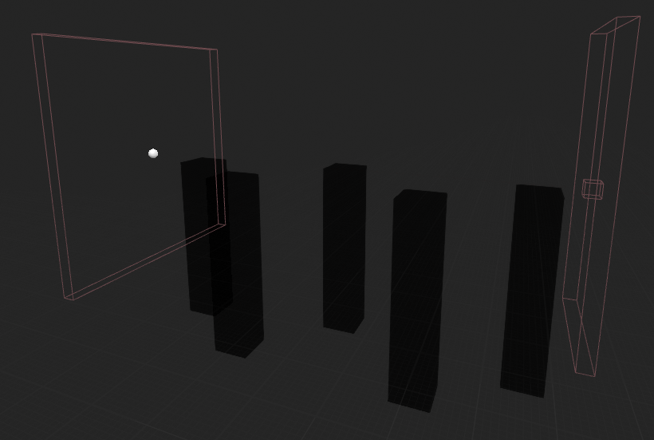|
  |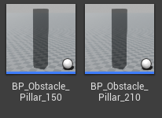 | z축으로 상승, 하강하는 사각기둥으로 이루어진 스테이지|

* ### 5. Disappear Floor Stage

  |||
  |:-:|:---|
  |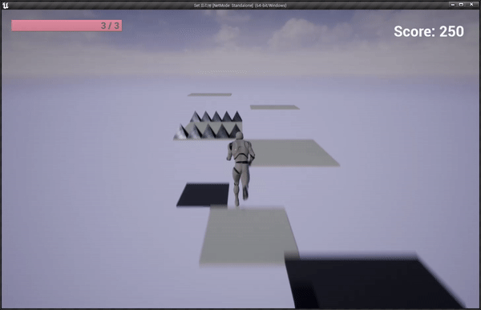|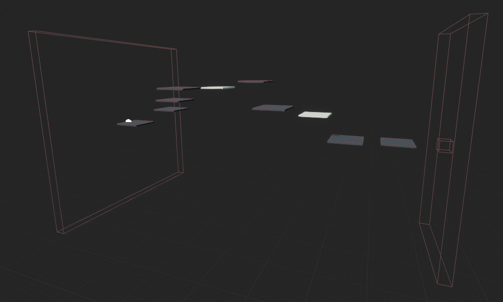|
  |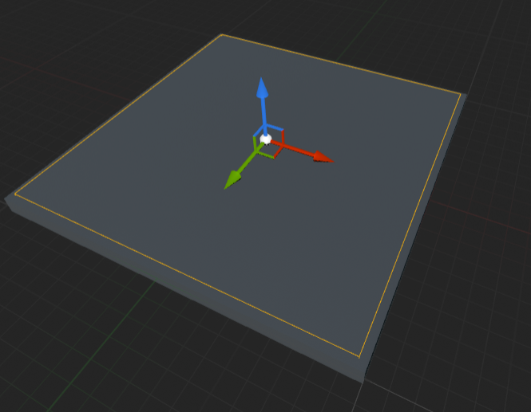 | 밟았을때 1초후에 사라지는 발판으로 이루어진 스테이지   밟았을때를 인식하기위해 발판보다 살짝 작은 Collider를 발판위에 부착|

---

## 프로젝트 후

* ### 소감 
  기획했던 첫번째 프로젝트를 엎은채 C++클래스를 추가한두번째 게임 프로젝트다.  블루프린트만 사용한 프로젝트에서 C++클래스까지 추가하니 상당히 난이도가 올라갔다.  개발했었을때만 해도   인스펙터에서 오브젝트를 대입하는 방법조차 모르고 진행했어서 당시에 GetAllActorsOfClass함수를 사용해 매우 비효율적으로 가져왔었던것이 생각난다.  본래 외국인 유튜버분의 강의영상인 2D로 만든 언리얼 게임을 카메라 위치를 바꾸어서 3D로 만들어보았고 그 외에 함정 
  
* ### 보완할점  
|||
|---|---|
|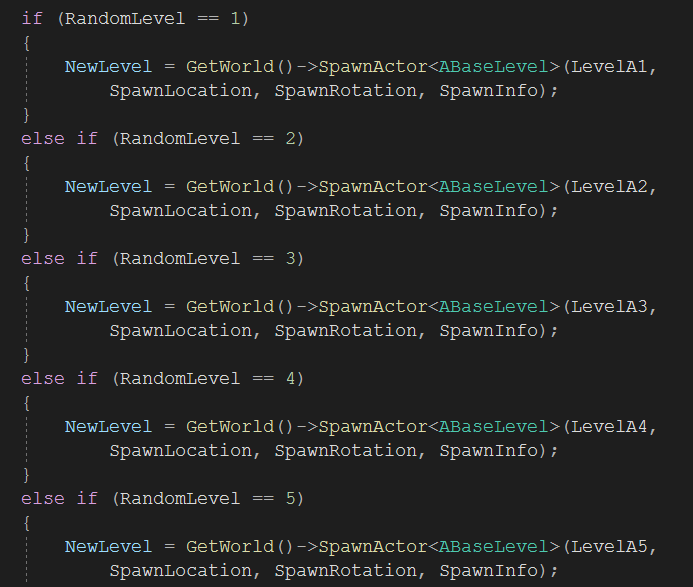|오브젝트 풀 (Object Pool)이라는 개념자체를 몰랐었는데, 같은 오브젝트를 계속 사용하고 반환하는 구조 상 오브젝트 풀을 구현하였  으면 순간적인 프레임드랍이 나타나지 않았을 것이다.|
||뒤에 쫒아오는 벽이 카메라 보다 앞에있을 떄 시야가 방해되어 플레이어가 정상적으로 게임할 수 없었다. 벽의 투명도를 얕게하는 조취를 취했으면 좋았을 것 같다.
